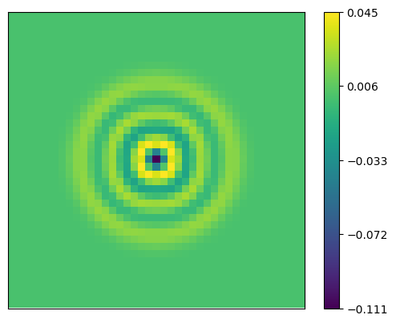

# Fornberg-Finite-Differences

Comprehensive finite difference library made to handle partial derivative equations in any dimension. Uses Eigen's C++ matrix math library extensively and adds to SparseMatrixBase through Eigen's plugin macro: EIGEN_SPARSEMATRIXBASE_PLUGIN. any libraries already making use of this macro can be added through the new macro EIGEN_SPARSEMATRIXBASE_PLUGIN_OTHER.

Ability to handle
 - any number of dimensions 1-4
 - any rectangular grid domain
 - any subdivision through time
 - expressions of linear operators in space
 - expressions of time derivatives of any order 
 - autonomous and time dependent coefficients 
 - Explicit Euler, Implicit Euler, Crank Nicolson solvers
 - Dirichlet, Neumann, Robin boundary conditions
 - external forcing terms
 - extensible outside_steps framework to allow arbitrary modifications between steps of solvers
